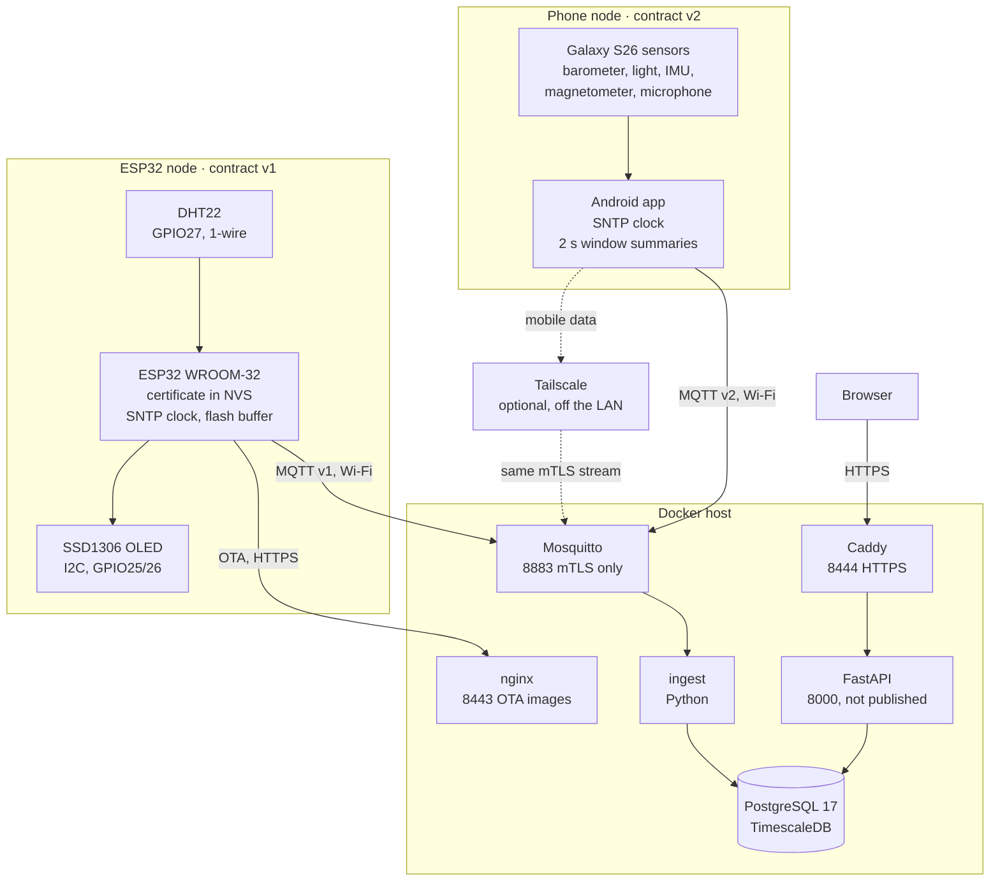
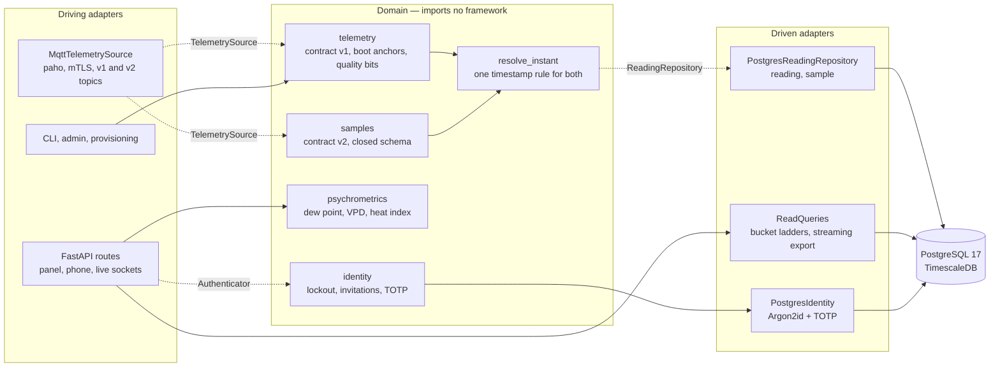
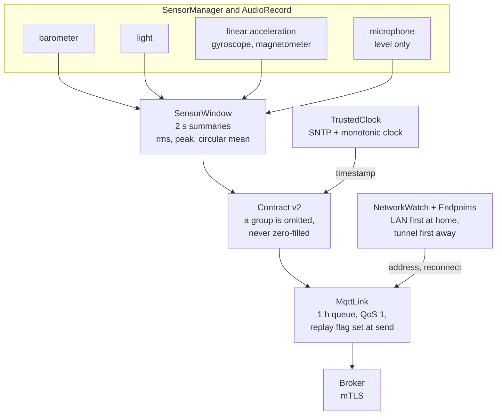
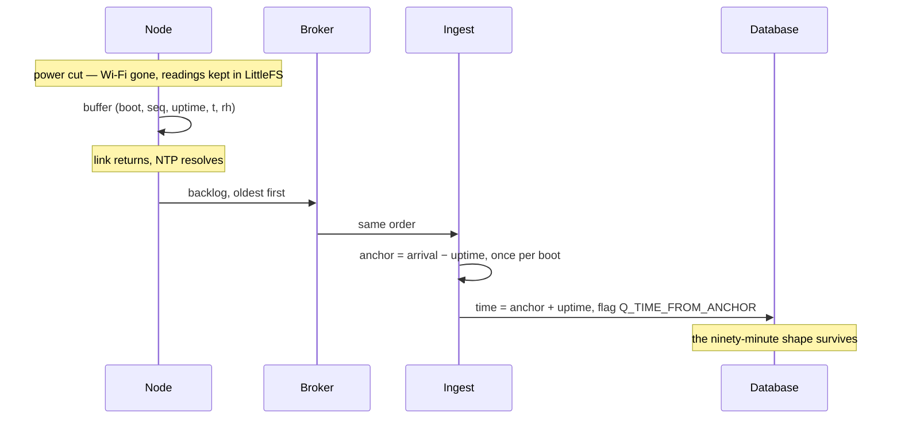
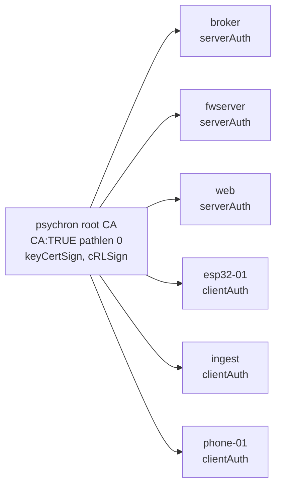

# psychron

[](LICENSE)
[](firmware/)
[](backend/)
[](frontend/)
[](android/)
[](#security)
[](#verifying)

An ESP32 measures a room and a phone adds seven more senses. Each node signs its telemetry with its own client certificate, and a Python service turns both streams into one record that survives outages, reboots, network changes and devices with no working clock.


https://github.com/user-attachments/assets/7cd61433-e8dd-42be-8adb-ff7d193a1d83

## At a glance

| | |
|---|---|
| **What it is** | An end-to-end environmental monitor — two sensor nodes, transport, database, API and panel — built as one system rather than six demos |
| **The one idea** | The reading is the asset. A room can be measured again; the elapsed calendar time cannot, so every design decision protects the continuity of the record |
| **Nodes** | ESP32 + DHT22 on a breadboard (temperature, humidity) · Galaxy S26 running a native app (pressure, light, sound level, motion, rotation, heading, battery temperature) |
| **Stack** | Arduino C++ · Kotlin, no AndroidX · Mosquitto over mTLS · Python 3.12, FastAPI, psycopg3 · PostgreSQL 17 + TimescaleDB · React 19 + TypeScript + uPlot · Caddy |
| **Size** | ~10,800 lines across firmware, app, backend, frontend, schema and infrastructure · 147 Python and 33 Kotlin tests, two sanitised firmware suites, 11 transport assertions |
| **How to run it** | `cd infra && ./bootstrap.sh && ./make-certs.sh && docker compose up -d` |

[Topology](#topology) · [Architecture](#architecture) · [The phone node](#the-phone-node) · [Why the timestamps are hard](#why-the-timestamps-are-hard) · [Security](#security) · [The record](#the-record) · [The panel](#the-panel) · [Running it](#running-it) · [Verifying](#verifying) · [Layout](#layout) · [Status](#status) · [Licence](#licence)

## Topology

Nothing crosses the network unauthenticated. The only listener a node can reach is the broker's mTLS port; the plaintext MQTT port does not exist. Each node may write only to its own topic, and the ESP32 and the phone speak different contract versions on different topic trees.



Topics are `psychron/v1/esp32-01/reading` and `psychron/v2/phone-01/sample`. Both nodes and the host set their clocks from the NTP pool, so every timestamp in the system is measured against one standard. Measured as arrival minus the node's own stamp, to the millisecond: median −1.8 ms for the ESP32, 23 ms for the phone.

## Architecture

Hexagonal, and not as decoration: the domain holds the parsing, the psychrometrics and the identity rules, and it imports nothing from FastAPI, psycopg or paho. Every adapter is replaceable because the core never learned its name.

Dotted edges are the ports — `TelemetrySource`, `ReadingRepository`, `Authenticator`. Swapping MQTT for anything else, or the local identity provider for an external one, means writing one class and changing no route.

The two contracts share one rule for time. Contract v1 (the ESP32's readings) and contract v2 (the phone's window summaries) are parsed separately, but both hand their envelope to `resolve_instant`, so a second node type got the timestamp logic by construction instead of a copy of it that drifts.



## The phone node

A native Android app turns the phone into a second node: seven sensor groups summarised into one message every two seconds, published under its own certificate. No AndroidX and one runtime dependency (Paho), because every library in the APK is code that runs with the microphone permission.



- **Audio never leaves the phone.** Each window's PCM is reduced in memory to two numbers, RMS and peak in dBFS, and discarded. Relative level, not dB SPL: a phone microphone is not calibrated, and the contract says so rather than inventing a unit.
- **Its own clock.** Android sets the wall clock from the mobile network, measured here at 475 ms ahead of NTP. The app asks the NTP pool itself, keeps the fastest of four exchanges, and carries that time forward on the monotonic clock, so a network time step can never move a window.
- **Network changes are events, not timeouts.** Leaving Wi-Fi reconnects on the new network in about a second instead of waiting for a keepalive to notice. With a tunnel address provisioned, the node keeps publishing on mobile data — see [docs/REMOTE-NODES.md](docs/REMOTE-NODES.md).
- **The screen shows the literal message.** Byte for byte what went on the wire, coloured but not reformatted, because "only summaries leave the device" is a claim and the message is the evidence.

## Why the timestamps are hard

The node has no real-time clock. It knows how long it has been running and nothing else, and after a power cut it starts counting from zero again. If it buffers readings through an outage and sends them on reconnect, stamping them on arrival collapses ninety minutes of history onto one instant — the outage disappears, and the record lies about the one thing it exists to preserve.

So the wire contract carries **uptime**, always valid, and a wall clock that may legitimately be `null` — to the millisecond when it is known, because nodes that agree to within tens of milliseconds are worth comparing at that resolution. Ingestion anchors each boot to real time once, then reconstructs every reading in that boot from its uptime.



Every reading also carries a quality word, so a doubtful value is stored and marked rather than dropped:

| Bit | Meaning | Set by |
|---|---|---|
| `0x01` | clock never synchronised | node |
| `0x02` | replayed from the buffer | node |
| `0x04` | previous read failed | node |
| `0x08` | outside the sensor's rated range | node |
| `0x10` | sampling interval drifted | node |
| `0x0100` | time reconstructed from the boot anchor | ingest |
| `0x0200` | no anchor existed; arrival time was all there was | ingest |

`(device, boot, seq)` is the identity of a reading, so a replayed backlog is idempotent: the second copy is a duplicate, not a new measurement.

That is also what makes delivery at-least-once on a client that only publishes at QoS 0. A publish accepted into the TCP buffer is not a reading the broker has, and a host network flap once lost 45 of them that way, each counted as sent. The node now holds every publish for two keepalives plus a margin — long enough for a dead stream to be noticed — and hands whatever is still unproven back to the buffer when the session ends. Sending a reading twice costs a row lookup; sending it zero times costs the reading.

## Security

One private CA, EC P-256 throughout, and no password anywhere on the wire.



| Concern | How |
|---|---|
| Broker access | mTLS only. `use_identity_as_username`, so the ACL is bound to the certificate CN and cannot be spoofed by a client-chosen name. The phone may write only under `psychron/v2/phone-01/`, and neither node can write to the other's topic |
| Plaintext fallback | None. Port 1883 has no listener and is not published; the firmware refuses to publish before the certificate store is complete and NTP has resolved |
| Node credentials | ESP32: provisioned over the USB cable into NVS in acknowledged chunks. Phone: pushed over adb into the app's private storage, with the temporary copy removed on exit. Never compiled into an image and never in the tree |
| Phone trust | The app trusts exactly one authority, the project CA, not the platform's store, and verifies the broker's name against whichever address it dialled |
| Remote access | Meant for a WireGuard tunnel (Tailscale) rather than an open port, so mutual TLS stays end to end and the broker is never on the internet |
| OTA | Streamed into the inactive partition while hashing; `Update.abort()` on a digest mismatch, commit only after full verification |
| Panel identity | Argon2id + TOTP, invitation-only enrolment, hashed session and invitation tokens, sliding-window lockout that counts unknown accounts too — otherwise the lockout is an enumeration oracle |
| Session cookie | httpOnly, SameSite=strict, `Secure` derived from the request scheme so local enrolment over loopback still works |
| Client address | `proxy_headers` with exactly one trusted proxy address, so "new location for this account" means something |
| Edge | Caddy terminates TLS, one origin for panel and API — no CORS to misconfigure. CSP `default-src 'self'` with no inline script |

`infra/check-mtls.sh` asserts eleven of these properties against the running stack, including that 1883 refuses connections, that a certificate from a rogue CA is rejected, and that each node is fenced into its own topic.

## The record

TimescaleDB hypertable plus three continuous aggregates. The API picks the bucket from the requested span, so a month and an hour cost about the same.

| Span | Source | Bucket |
|---|---|---|
| ≤ 3 h | `reading` | 3 s (raw) |
| ≤ 2 d | `reading_1m` | 1 min |
| ≤ 60 d | `reading_1h` | 1 hour |
| beyond | `reading_1d` | 1 day |

The phone's window summaries live in a second hypertable, `sample`, with a range check on every measurement column, and its own ladder: raw 2 s windows up to an hour, then 30 s, 2 min, 1 h and 1 day buckets. Headings are averaged on the circle, so 359° and 1° make 0°, not 180°.

Results are capped at 5,000 points; exports stream through a server-side cursor instead. Gaps are found from the data rather than reported by the node — a device that dies cannot announce it — and are drawn as gaps, never interpolated.

`infra/backup.sh` dumps in custom format to a temporary name, moves it into place only on success, and refuses to keep a dump that does not contain the expected tables.

## The panel

One page. Current reading and derived quantities, history with a range selector, distribution of the window as a box with whiskers and the live value marked on the same axis, record integrity, provenance, export, and the gaps and boots the record knows about. Below it, the phone: live tiles over a websocket, the three-hour pressure tendency in the Met Office's words, light on a logarithmic meter, a compass, and history for every group on the same range selector.

Measured and derived values are set apart typographically, because a dew point carries the sensor's error *and* the error of a fitted equation, and no legend should have to say so. Light theme by default with an explicit toggle; nothing follows the operating system.

Four things it does that a room dashboard usually does not:

- **Outages are marked on the time axis**, drawn onto the chart's own canvas so the marks cannot drift out of alignment with the trace.
- **The record is counted in the masthead** — first reading, total, elapsed days. If the claim is that elapsed time cannot be recaptured, the amount captured belongs where it can be read at a glance.
- **Each headline number carries its movement against the same instant a day earlier**, and says *no reading 24 h ago* rather than *0.0* when the comparison does not exist.
- **The selected window lives in the URL**, so a window worth looking at can be sent to someone.

## Running it

Requires Docker, and a `secrets.h` for the firmware.

```bash
cd infra
./bootstrap.sh                # writes .env with a fresh database password
./make-certs.sh               # private CA and the six certificates
docker compose up -d          # db, broker, ingest, api, web, fwserver
./check-mtls.sh               # assert the transport is what it claims
```

Set `PSYCHRON_MQTT_HOST` in `.env` to this host's LAN address before generating
the certificates — `make-certs.sh` reads it from there into the broker
certificate's `subjectAltName`, and a name that is not in there fails hostname
verification with an error that points at the certificate rather than at the
missing name. For a phone node on mobile data, add `PSYCHRON_MQTT_REMOTE_HOST`
and re-run it: see [docs/REMOTE-NODES.md](docs/REMOTE-NODES.md).

Caddy serves the panel from `frontend/dist`, which is a build output and is not
in the repository, so build it once:

```bash
cd ../frontend && npm ci && npm run build
```

The panel is then on `https://localhost:8444`. The admin and provisioning tools
run on the host rather than in a container, so install the backend once:

```bash
python -m venv backend/.venv && backend/.venv/Scripts/pip install -e "backend[dev]"
```

Create the first account — whoever enrols first becomes the owner. The command
prints a single-use link; the authenticator secret and the recovery codes are
shown in the browser at enrolment and never in a terminal:

```bash
python -m psychron.admin invite you@example.local
```

Flash the firmware from the Arduino IDE, then load its certificate over the cable:

```bash
python -m psychron.provision --port COM4
```

For the phone node, build and install the app with USB or wireless debugging enabled, then load its identity. The key goes into the app's private storage, never into the APK:

```bash
cd android && ./gradlew installDebug
cd ../infra && ./provision-phone.sh
```

## Verifying

```bash
./verify.sh
```

Four suites, because they answer different questions and none replaces another:
the Python tests say the arithmetic is right, the payload tests say the
serialiser cannot walk off the end of its buffer, the unconfirmed-publish tests
say a reading is held until it is proven delivered, and the mTLS checks say the
transport really refuses what it claims to refuse — the only one that can be
wrong while every unit test still passes.

The firmware suites run under AddressSanitizer and UBSan with a host C++17
compiler, or in a Debian container when there is none, and are reported as
skipped when neither exists rather than quietly counting as a pass. The app's
own tests — contract encoding, the SNTP arithmetic, endpoint choice — run with
`./gradlew testDebugUnitTest` in `android/`.

## Layout

```
firmware/psychron_node/   sensor, panel, ring buffer, unconfirmed window, mTLS link, OTA
firmware/test/            host-side tests for the payload builder and the window, ASan + UBSan
android/                  the phone node: sensors, SNTP clock, network watch, mTLS link
backend/src/psychron/     domain, ports, adapters, API, CLI, phone simulator
db/migrations/            schema, hypertables, continuous aggregates, identity
frontend/src/             the panel
infra/                    compose stack, PKI, Caddy, provisioning, backup and assertion scripts
docs/CONTRACT.md          contract v1, the ESP32's readings, and why it cannot change
docs/CONTRACT-v2.md       contract v2, the phone's window summaries
docs/REMOTE-NODES.md      keeping the phone connected on mobile data
docs/media/               the diagrams above, rendered at 3x for slides and video
verify.sh                 every check this project can run against itself
```

## Status

Working end to end: telemetry from both nodes to the panel, mTLS throughout, millisecond timestamps against NTP, reconstruction across outages, at-least-once delivery from the ESP32, network handover on the phone, OTA with verified digests, bounded queries and streaming exports, identity with MFA and invitations, verified backup and restore.

Open, honestly:

- **The phone's key is a file.** It sits in app-private storage, protected from other apps but not from someone holding the unlocked phone with a debugger, and it existed on the host before it existed on the phone. Generating it inside StrongBox, where it can never be exported, is the next step.
- **The phone's queue lives in memory.** An hour of windows survives a network outage but not the app being killed.
- **Mobile data needs a tunnel set up by hand.** The node and the certificates support it; installing Tailscale on the host and the phone is manual.

- **No OTA rollback.** The image is verified before it is committed, but the Arduino bootloader carries no rollback machinery; a firmware that boots and then misbehaves needs the cable.
- **Forecasting is not implemented.** The panel shows progress toward the fourteen days of history a daily-cycle model would need, and says so rather than drawing a line through three hours of data.
- **The psychrometric chart was removed.** Its fixed axes covered a range twenty times wider than the room's, so the entire history rendered as a smudge in one corner. It can return with axes fitted to the data.
- **Lockout is per identifier, not per origin.** A distributed attempt against many identifiers is not slowed down.
- **No flash encryption.** It requires the second-stage bootloader to do the encrypting, which the Arduino bootloader does not; moving the build to ESP-IDF is the prerequisite.
- **No tests at the API layer.** The domain and the payload builder are covered; the routes are not.

## Licence

[MIT](LICENSE). The certificates, credentials and device identity are generated
locally and are not part of it — see `infra/make-certs.sh` and the notes in
`.gitignore` for what never leaves the machine.
