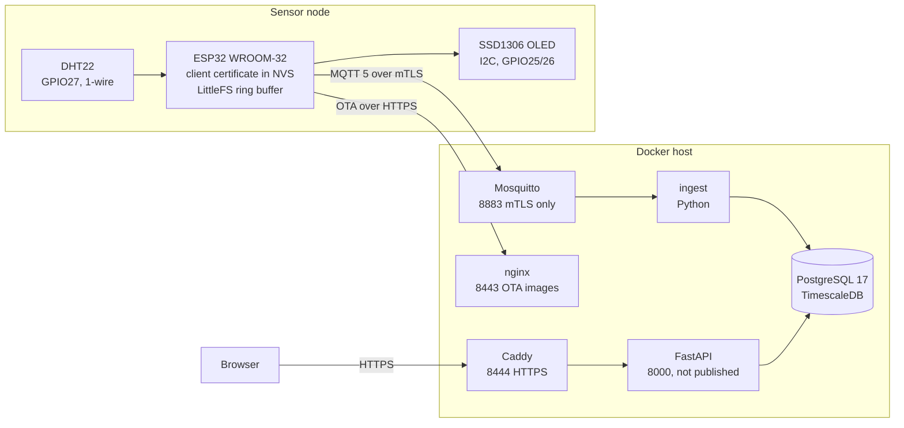
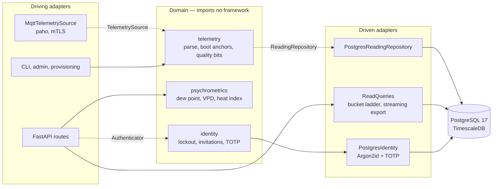
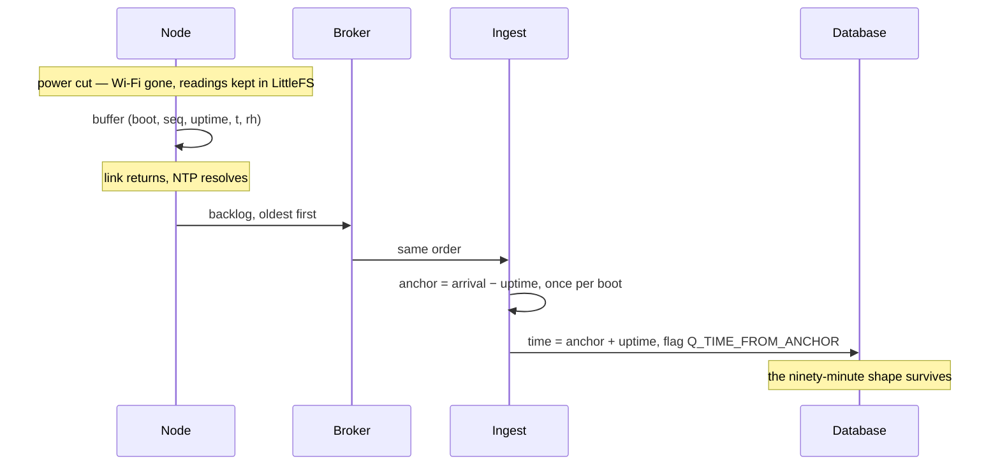
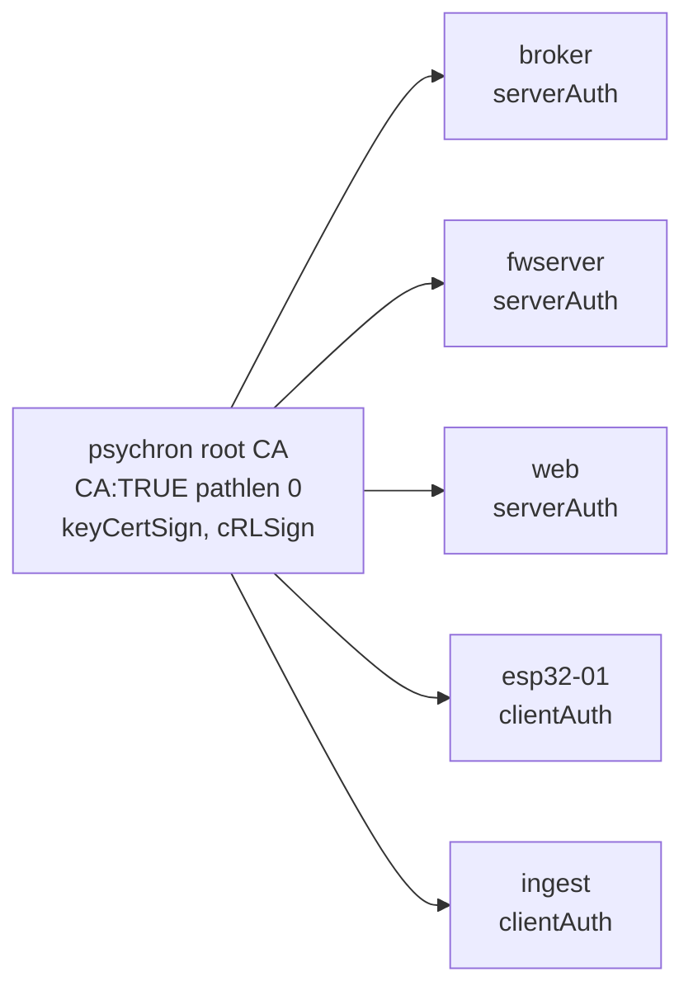

# psychron

[](LICENSE)
[](firmware/)
[](backend/)
[](frontend/)
[](#security)
[](#verifying)

An ESP32 measures a room, signs its own telemetry with a client certificate, and a Python service turns it into a record that survives outages, reboots and a device with no working clock.


https://github.com/user-attachments/assets/7cd61433-e8dd-42be-8adb-ff7d193a1d83

## At a glance

| | |
|---|---|
| **What it is** | An end-to-end environmental monitor — sensor, transport, database, API and panel — built as one system rather than five demos |
| **The one idea** | The reading is the asset. A room can be measured again; the elapsed calendar time cannot, so every design decision protects the continuity of the record |
| **Stack** | ESP32 WROOM-32 + DHT22 · Arduino C++ · Mosquitto over mTLS · Python 3.12, FastAPI, psycopg3 · PostgreSQL 17 + TimescaleDB · React 19 + TypeScript + uPlot · Caddy |
| **Size** | ~6,500 lines across firmware, backend, frontend, schema and infrastructure · 82 tests |
| **How to run it** | `cd infra && ./bootstrap.sh && ./make-certs.sh && docker compose up -d` |

[Topology](#topology) · [Architecture](#architecture) · [Why the timestamps are hard](#why-the-timestamps-are-hard) · [Security](#security) · [The record](#the-record) · [The panel](#the-panel) · [Running it](#running-it) · [Verifying](#verifying) · [Layout](#layout) · [Status](#status) · [Licence](#licence)

## Topology

Nothing crosses the network unauthenticated. The only listener the node can reach is the broker's mTLS port; the plaintext MQTT port does not exist.



## Architecture

Hexagonal, and not as decoration: the domain holds the parsing, the psychrometrics and the identity rules, and it imports nothing from FastAPI, psycopg or paho. Every adapter is replaceable because the core never learned its name.

Dotted edges are the ports — `TelemetrySource`, `ReadingRepository`, `Authenticator`. Swapping MQTT for anything else, or the local identity provider for an external one, means writing one class and changing no route.



## Why the timestamps are hard

The node has no real-time clock. It knows how long it has been running and nothing else, and after a power cut it starts counting from zero again. If it buffers readings through an outage and sends them on reconnect, stamping them on arrival collapses ninety minutes of history onto one instant — the outage disappears, and the record lies about the one thing it exists to preserve.

So the wire contract carries **uptime**, always valid, and a wall clock that may legitimately be `null`. Ingestion anchors each boot to real time once, then reconstructs every reading in that boot from its uptime.



Every reading also carries a quality word, so a doubtful value is stored and marked rather than dropped:

| Bit | Meaning | Set by |
|---|---|---|
| `0x01` | clock never synchronised | node |
| `0x02` | replayed from the buffer | node |
| `0x04` | previous read failed | node |
| `0x08` | outside the sensor's rated range | node |
| `0x10` | sampling interval drifted | node |
| `0x0100` | time reconstructed from the boot anchor | ingest |
| `0x0200` | no anchor existed; arrival time was all there was | ingest |

`(device, boot, seq)` is the identity of a reading, so a replayed backlog is idempotent: the second copy is a duplicate, not a new measurement.

That is also what makes delivery at-least-once on a client that only publishes at QoS 0. A publish accepted into the TCP buffer is not a reading the broker has, and a host network flap once lost 45 of them that way, each counted as sent. The node now holds every publish for two keepalives plus a margin — long enough for a dead stream to be noticed — and hands whatever is still unproven back to the buffer when the session ends. Sending a reading twice costs a row lookup; sending it zero times costs the reading.

## Security

One private CA, EC P-256 throughout, and no password anywhere on the wire.



| Concern | How |
|---|---|
| Broker access | mTLS only. `use_identity_as_username`, so the ACL is bound to the certificate CN and cannot be spoofed by a client-chosen name |
| Plaintext fallback | None. Port 1883 has no listener and is not published; the firmware refuses to publish before the certificate store is complete and NTP has resolved |
| Node credentials | Provisioned over the USB cable into NVS in acknowledged chunks, never compiled into the image and never in the tree |
| OTA | Streamed into the inactive partition while hashing; `Update.abort()` on a digest mismatch, commit only after full verification |
| Panel identity | Argon2id + TOTP, invitation-only enrolment, hashed session and invitation tokens, sliding-window lockout that counts unknown accounts too — otherwise the lockout is an enumeration oracle |
| Session cookie | httpOnly, SameSite=strict, `Secure` derived from the request scheme so local enrolment over loopback still works |
| Client address | `proxy_headers` with exactly one trusted proxy address, so "new location for this account" means something |
| Edge | Caddy terminates TLS, one origin for panel and API — no CORS to misconfigure. CSP `default-src 'self'` with no inline script |

`infra/check-mtls.sh` asserts seven of these properties against the running stack, including that 1883 refuses connections and that a certificate from a rogue CA is rejected.

## The record

TimescaleDB hypertable plus three continuous aggregates. The API picks the bucket from the requested span, so a month and an hour cost about the same.

| Span | Source | Bucket |
|---|---|---|
| ≤ 3 h | `reading` | 3 s (raw) |
| ≤ 2 d | `reading_1m` | 1 min |
| ≤ 60 d | `reading_1h` | 1 hour |
| beyond | `reading_1d` | 1 day |

Results are capped at 5,000 points; exports stream through a server-side cursor instead. Gaps are found from the data rather than reported by the node — a device that dies cannot announce it — and are drawn as gaps, never interpolated.

`infra/backup.sh` dumps in custom format to a temporary name, moves it into place only on success, and refuses to keep a dump that does not contain the expected tables.

## The panel

One page. Current reading and derived quantities, history with a range selector, distribution of the window as a box with whiskers and the live value marked on the same axis, record integrity, provenance, export, and the gaps and boots the record knows about.

Measured and derived values are set apart typographically, because a dew point carries the sensor's error *and* the error of a fitted equation, and no legend should have to say so. Light theme by default with an explicit toggle; nothing follows the operating system.

Four things it does that a room dashboard usually does not:

- **Outages are marked on the time axis**, drawn onto the chart's own canvas so the marks cannot drift out of alignment with the trace.
- **The record is counted in the masthead** — first reading, total, elapsed days. If the claim is that elapsed time cannot be recaptured, the amount captured belongs where it can be read at a glance.
- **Each headline number carries its movement against the same instant a day earlier**, and says *no reading 24 h ago* rather than *0.0* when the comparison does not exist.
- **The selected window lives in the URL**, so a window worth looking at can be sent to someone.

## Running it

Requires Docker, and a `secrets.h` for the firmware.

```bash
cd infra
./bootstrap.sh                # writes .env with a fresh database password
./make-certs.sh               # private CA and the five certificates
docker compose up -d          # db, broker, ingest, api, web, fwserver
./check-mtls.sh               # assert the transport is what it claims
```

Set `PSYCHRON_MQTT_HOST` in `.env` to this host's LAN address, and `BROKER_IP`
in `make-certs.sh` to the same one before generating the certificates — it is
what goes into the broker certificate's `subjectAltName`, and a name that is not
in there fails hostname verification with an error that points at the
certificate rather than at the missing name.

Caddy serves the panel from `frontend/dist`, which is a build output and is not
in the repository, so build it once:

```bash
cd ../frontend && npm ci && npm run build
```

The panel is then on `https://localhost:8444`. The admin and provisioning tools
run on the host rather than in a container, so install the backend once:

```bash
python -m venv backend/.venv && backend/.venv/Scripts/pip install -e "backend[dev]"
```

Create the first account — whoever enrols first becomes the owner. The command
prints a single-use link; the authenticator secret and the recovery codes are
shown in the browser at enrolment and never in a terminal:

```bash
python -m psychron.admin invite you@example.local
```

Flash the firmware from the Arduino IDE, then load its certificate over the cable:

```bash
python -m psychron.provision --port COM4
```

## Verifying

```bash
./verify.sh
```

Three suites, because they answer different questions and none replaces another:
the Python tests say the arithmetic is right, the payload tests say the
serialiser cannot walk off the end of its buffer, and the mTLS checks say the
transport really refuses what it claims to refuse — the only one of the three
that can be wrong while every unit test still passes.

The payload suite needs a host C++17 compiler and is reported as skipped when
there is none, rather than quietly counting as a pass.

## Layout

```
firmware/psychron_node/   sensor, panel, ring buffer, mTLS link, OTA, provisioning
firmware/test/            host-side tests for the payload builder, ASan + UBSan
backend/src/psychron/     domain, ports, adapters, API, CLI
db/migrations/            schema, hypertable, continuous aggregates, identity
frontend/src/             the panel
infra/                    compose stack, PKI, Caddy, backup and assertion scripts
docs/CONTRACT.md          the wire contract, and why it cannot change
docs/media/               the diagrams above, rendered at 3x for slides and video
verify.sh                 every check this project can run against itself
```

## Status

Working end to end: telemetry from sensor to panel, mTLS throughout, timestamp reconstruction across outages, OTA with verified digests, bounded queries and streaming exports, identity with MFA and invitations, verified backup and restore.

Open, honestly:

- **No OTA rollback.** The image is verified before it is committed, but the Arduino bootloader carries no rollback machinery; a firmware that boots and then misbehaves needs the cable.
- **Forecasting is not implemented.** The panel shows progress toward the fourteen days of history a daily-cycle model would need, and says so rather than drawing a line through three hours of data.
- **The psychrometric chart was removed.** Its fixed axes covered a range twenty times wider than the room's, so the entire history rendered as a smudge in one corner. It can return with axes fitted to the data.
- **Lockout is per identifier, not per origin.** A distributed attempt against many identifiers is not slowed down.
- **No flash encryption.** It requires the second-stage bootloader to do the encrypting, which the Arduino bootloader does not; moving the build to ESP-IDF is the prerequisite.
- **No tests at the API layer.** The domain and the payload builder are covered; the routes are not.

## Licence

[MIT](LICENSE). The certificates, credentials and device identity are generated
locally and are not part of it — see `infra/make-certs.sh` and the notes in
`.gitignore` for what never leaves the machine.
